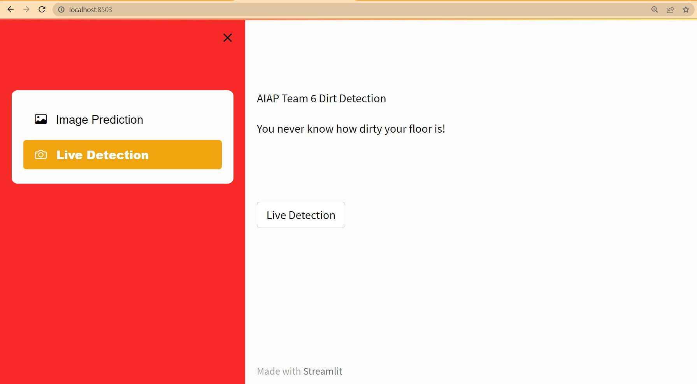
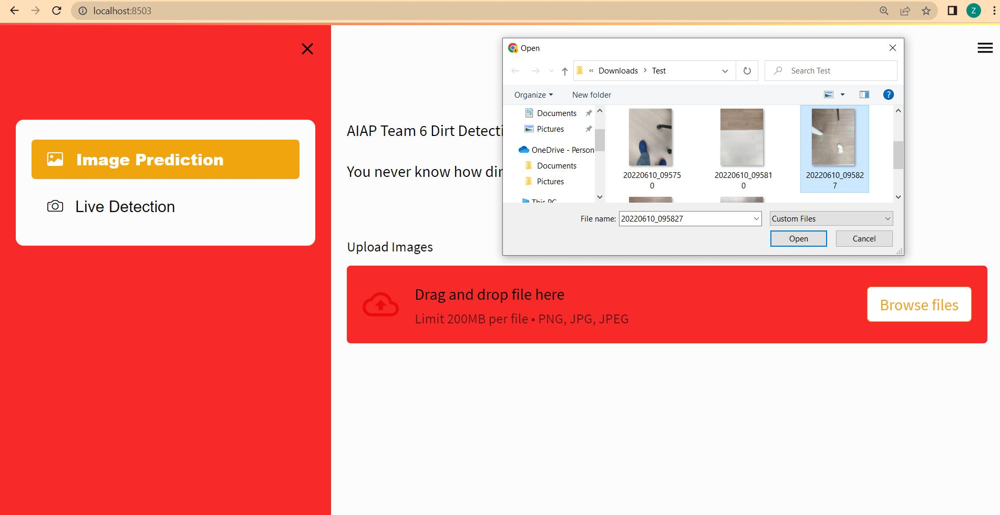
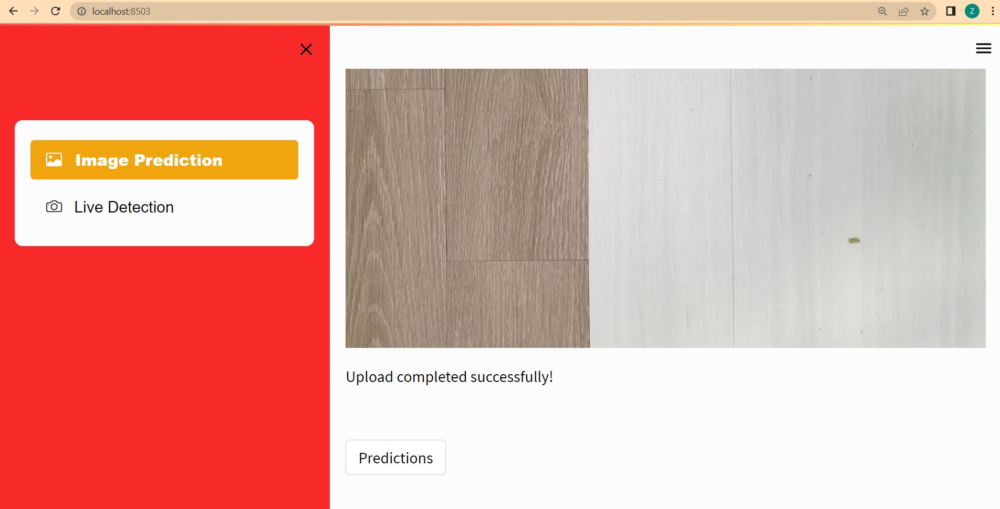
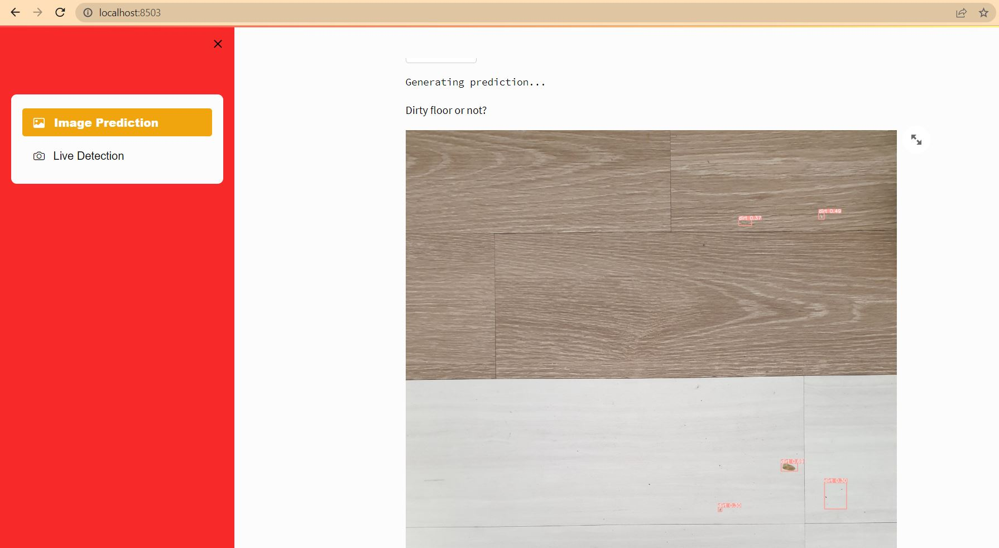

## Team 6: Dirt Detection Project

### Context:

We are a team of 6 apprentices coming together at the end of a bootcamp to create a AI/ML project for a model deployment presentation.

It took us 3 and a half days to complete this project. The model architecture is taken from the DirtNet paper listed below.

The dataset is curated and augmented by the same team responsible for the paper.

The YOLOv3 implementation is taken from ultralytics.

The model is locally deployed to Streamlit with FastAPI.

### Credits

Richard Bormann; Xinjie Wang; Jiawen Xu; Joel Schmidt
for the DirtNet Paper and Model Architecture
https://ieeexplore.ieee.org/document/9196559

Dataset: ipa_dirt_detection
R. Bormann, F. Weisshardt, G. Arbeiter, and J. Fischer. 
Autonomous dirt detection for cleaning in office environments. 
In Proceedings of the IEEE International Conference on Robotics and Automation (ICRA), 
pages 1252–1259, 2013.
https://owncloud.fraunhofer.de/index.php/s/AjsDYny2Xmxyl44

Glenn Jocher - YOLOv3 Pytorch Implementation
https://github.com/ultralytics/yolov3

### How the App turn out

### Live Detection

The live detection feature is a simple inference call with source directed to the computer's webcam.
