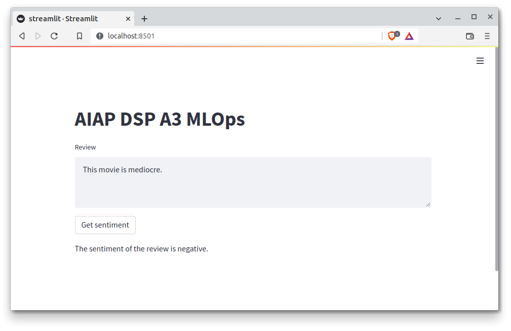
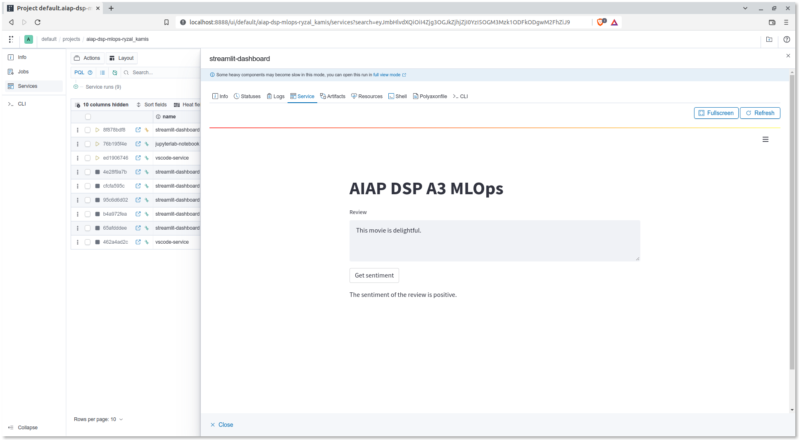

<!-- omit in toc -->
# Streamlit

There are 4 main ways we recommend to spin up Streamlit
applications for quick dashboarding:

- [Local Execution](#local-execution)
- [Docker Container](#docker-container)
- [Integration with Polyaxon](#integration-with-polyaxon)
- [Native Kubernetes Deployment (GKE)](#native-kubernetes-deployment-gke)

The Streamlit demo created in this guide will accept a string as an
input, and the dashboard will provide an output as to whether the
sentiment is "positive" or "negative", following the
[guide's problem statement](02-preface.md#guides-problem-statement).

This guide will be similar to that of ["Deployment"](08-deployment.md)
and ["Batch Inferencing"](09-batch-inferencing.md), with the difference
mainly being the use of Streamlit as an interface
to get your inputs and show your outputs from.

While it is possible for Streamlit to interact with the FastAPI
deployment backend as a frontend engine/interface,
for simplicities' sake,
we will only dealing with the use case where
Streamlit application directly loads the predictive model downloaded
from GCS. For small scale infrastructure or prototyping,
this would be sufficient in terms of simplicity and efficiency.

This template provides:

- a Python script (`src/streamlit.py`)
- a Dockerfile for containerised executions
  (`docker/aiap-team6-miniproject-streamlit.Dockerfile`)
- a Polyaxon config file for spinning up a Streamlit service
  (`aisg-context/polyaxon/polyaxonfiles/streamlit.yml`)

## Local Execution

To run the Streamlit app locally, one of course has to download a
predictive model into the local machine:

=== "Linux/macOS"

    ```bash
    $ export PRED_MODEL_UUID="<MLFLOW_EXPERIMENT_UUID>"
    $ export PRED_MODEL_GCS_URI="gs://aiap-team6-miniproject-artifacts/mlflow-tracking-server/team6_fl_msd/$PRED_MODEL_UUID"
    $ gsutil cp -r $PRED_MODEL_GCS_URI ./models
    ```

=== "Windows PowerShell"

    ```powershell
    $ $Env:PRED_MODEL_UUID='<MLFLOW_EXPERIMENT_UUID>'
    $ $PRED_MODEL_GCS_URI="gs://aiap-team6-miniproject-artifacts/mlflow-tracking-server/team6_fl_msd/$Env:PRED_MODEL_UUID"
    $ gsutil cp -r $PRED_MODEL_GCS_URI .\models
    ```

`PRED_MODEL_UUID` is the unique ID associated with the MLFLow run
that generated the predictive model to be used for dashboarding.

Spin up the Streamlit application locally:

=== "Linux/macOS"

    ```bash
    $ export PRED_MODEL_PATH="$PWD/models/$PRED_MODEL_UUID/artifacts/model/data/model"
    $ streamlit run src/streamlit.py -- \
        hydra.run.dir=. hydra.output_subdir=null hydra/job_logging=disabled \
        inference.model_path=$PRED_MODEL_PATH
    ```

=== "Windows PowerShell"

    ```powershell
    $ $Env:PRED_MODEL_PATH="$(Get-Location)\models\$Env:PRED_MODEL_UUID\artifacts\model\data\model"
    $ streamlit run src/streamlit.py -- `
        hydra.run.dir=. hydra.output_subdir=null hydra/job_logging=disabled `
        inference.model_path=$Env:PRED_MODEL_PATH
    ```

The application would look like the screenshot below:



__Reference(s):__

- [Streamlit Docs - Run Streamlit apps](https://docs.streamlit.io/library/advanced-features/configuration#run-streamlit-apps)

## Docker Container

To use the Docker image, first build it:

=== "Linux/macOS"

    ```bash
    $ docker build \
        -t asia.gcr.io/aiap-10-ds/team6_fl_msd/streamlit:0.1.0 \
        --build-arg PRED_MODEL_UUID="$PRED_MODEL_UUID" \
        -f docker/aiap-team6-miniproject-streamlit.Dockerfile \
        --platform linux/amd64 .
    ```

=== "Windows PowerShell"

    ```powershell
    $ docker build `
        -t asia.gcr.io/aiap-10-ds/team6_fl_msd/streamlit:0.1.0 `
        --build-arg PRED_MODEL_UUID="$Env:PRED_MODEL_UUID" `
        -f docker/aiap-team6-miniproject-streamlit.Dockerfile `
        --platform linux/amd64 .
    ```

After building the image, you can run the container like so:

=== "Linux/macOS"

    ```bash
    $ sudo chgrp -R 2222 outputs
    $ docker run --rm -p 8501:8501 \
        --name streamlit-app \
        --env GOOGLE_APPLICATION_CREDENTIALS=/var/secret/cloud.google.com/gcp-service-account.json \
        -v <PATH_TO_SA_JSON_FILE>:/var/secret/cloud.google.com/gcp-service-account.json \
        -v $PWD/models:/home/aisg/from-gcs \
        asia.gcr.io/aiap-10-ds/team6_fl_msd/streamlit:0.1.0
    ```

=== "Windows PowerShell"

    ```powershell
    $ docker run --rm -p 8501:8501 `
        --name streamlit-app `
        --env GOOGLE_APPLICATION_CREDENTIALS=/var/secret/cloud.google.com/gcp-service-account.json `
        -v "<PATH_TO_SA_JSON_FILE>:/var/secret/cloud.google.com/gcp-service-account.json" `
        -v "$(Get-Location)\models:/home/aisg/from-gcs" `
        asia.gcr.io/aiap-10-ds/team6_fl_msd/streamlit:0.1.0
    ```

- `GOOGLE_APPLICATION_CREDENTIALS` allows the container's entrypoint to
  download the predictive model specified during build time from GCS.
- `-v <PATH_TO_SA_JSON_FILE>:/var/secret/cloud.google.com/gcp-service-account.json`
  attaches the JSON file for the service account credentials to the
  Docker container.
- `-v $PWD/models:/home/aisg/from-gcs` allows the models downloaded to
  the host machine to be used by the container after being mounted to
  `/home/aisg/from-gcs`.

To stop the container:

```bash
$ docker container stop streamlit-app
```

## Integration with Polyaxon

!!! attention

    As this mode of deployment would take up resources in a
    long-running manner, please tear the service down through
    the dashboard once you've gone through this part of the guide.

From the Docker build section, push the Docker image to GCR:

```bash
$ docker push asia.gcr.io/aiap-10-ds/team6_fl_msd/streamlit:0.1.0
```

Then, push the configurations to the Polyaxon server to start up the
Streamlit dashboard:

=== "Linux/macOS"

    ```bash
    $ polyaxon run \
      -f aisg-context/polyaxon/polyaxonfiles/streamlit-service.yml \
      -P DOCKER_IMAGE="asia.gcr.io/aiap-10-ds/team6_fl_msd/streamlit:0.1.0" \
      -p aiap-team6-miniproject-<YOUR_NAME>
    ```

=== "Windows PowerShell"

    ```powershell
    $ polyaxon run `
      -f aisg-context/polyaxon/polyaxonfiles/streamlit-service.yml `
      -P DOCKER_IMAGE="asia.gcr.io/aiap-10-ds/team6_fl_msd/streamlit:0.1.0" `
      -p aiap-team6-miniproject-<YOUR_NAME>
    ```

Just like with the VSCode or JupyterLab services, you can access
the Streamlit service you've just spun up through the Polyaxon
dashboard:



__Reference(s):__

- [Polyaxon - Integrations](https://polyaxon.com/integrations/streamlit/)

## Native Kubernetes Deployment (GKE)

!!! attention

    As this mode of deployment would take up resources in a
    long-running manner, please tear it down once you've
    gone through this part of the guide. If you do not have the right
    permissions, please request assistance from your team lead or the
    administrators.

Similar to deploying [the FastAPI server](08-deployment.md#deploy-to-gke),
to deploy the Streamlit dashboard on GKE, you can make use of the
sample Kubernetes manifest files provided with this template:

```bash
$ kubectl apply -f aisg-context/k8s/dashboard/streamlit-deployment.yml --namespace=polyaxon-v1
$ kubectl apply -f aisg-context/k8s/dashboard/streamlit-service.yml --namespace=polyaxon-v1
```

To access the server, you can port-forward the service to a local port
like such:

=== "Local Machine"

    ```bash
    $ kubectl port-forward service/streamlit-team6-fl-msd-svc 8501:8501 --namespace=polyaxon-v1
    Forwarding from 127.0.0.1:8501 -> 8501
    Forwarding from [::1]:8501 -> 8501
    ```

!!! attention

    Please tear down the deployment and service objects once they are
    not required.
    
    === "Local Machine"

        ```bash
        $ kubectl delete streamlit-team6-fl-msd-deployment --namespace=polyaxon-v1
        $ kubectl delete streamlit-team6-fl-msd-svc --namespace=polyaxon-v1
        ```
    
    If you do not have the right
    permissions, please request assistance from your team lead or the
    administrators.
